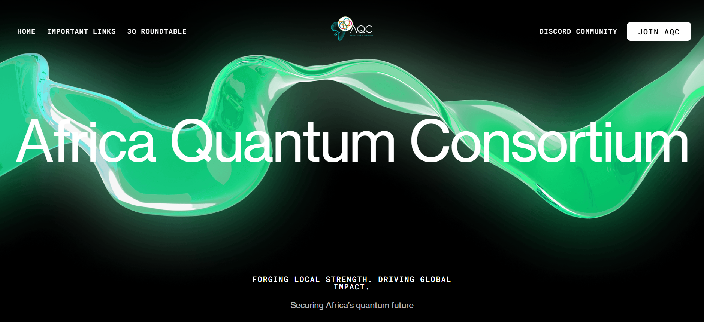

# Africa Quantum Consortium (AQC) Talent Directory

## Overview

This is a modern remake of the Africa Quantum Consortium's talent directory section, redesigned to showcase member benefits and encourage new talent acquisition in the quantum technology space across Africa.

## Technology Stack

- **HTML5** - Semantic markup and video element support
- **CSS3** - Modern styling with gradients, responsive design, and smooth transitions
- **Vanilla JavaScript** - Lightweight interactivity without dependencies

## Design & Assets

### UI Design
- **Source**: Webflow (Free Template)
- **License**: Free of charge, no licensing restrictions
- **Customization**: Extensively modified and optimized for AQC branding

### Legal Compliance
✅ **No licensing fees required**  
✅ **All assets are either paid for or completely free**  
✅ **No copyrighted material without permission**  
✅ **Safe for commercial deployment**

## Features

### Core Functionality
- **Responsive Design** - Optimized for desktop, tablet, and mobile devices
- **Video Integration** - Native HTML5 video with standard browser controls
- **Interactive Elements** - Hover effects and smooth transitions
- **Accessibility** - Semantic HTML and proper contrast ratios

## Deployment

### Requirements
- Any modern web server (Apache, Nginx, or static hosting)
- No server-side dependencies
- No build process required

### Quick Deploy
1. Upload all files to your web server
2. Deploy to production

### Hosting Compatibility
- ✅ GitHub Pages
- ✅ Netlify
- ✅ Vercel
- ✅ AWS S3 + CloudFront
- ✅ Traditional web hosting

## Browser Support

| Browser | Version | Status |
|---------|---------|--------|
| Chrome | 60+ | ✅ Full Support |
| Firefox | 55+ | ✅ Full Support |
| Safari | 12+ | ✅ Full Support |
| Edge | 79+ | ✅ Full Support |
| Mobile Safari | 12+ | ✅ Full Support |
| Chrome Mobile | 60+ | ✅ Full Support |

## Performance

- **Lightweight**: < 78MB total file size (excluding video)
- **Mobile Optimized**: Touch-friendly interface with responsive breakpoints
- **SEO Ready**: Semantic HTML structure

**Built with ❤️ for the Africa Quantum Consortium**  
*Securing Africa’s quantum future*